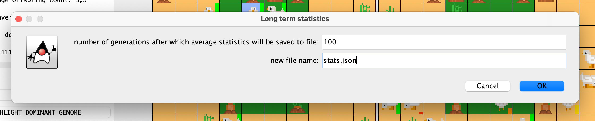

# Evolution Simulation

## Table of Contents
- [Evolution Simulation](#evolution-simulation)
  - [Table of Contents](#table-of-contents)
  - [Description](#description)
  - [Intent](#intent)
  - [Screenshots](#screenshots)
  - [Technologies Used](#technologies-used)
  - [Credits](#credits)

## Description
The project simulates life of a custom species with special focus on genetics. Apart from the implementation of natural processes among the population, the focus was put on creating a graphical user interface which allows monitoring the changing world's statistics, observing life of a specific individual and displaying the dominant genome.

Evolution-Simulation project was created for the Object-Oriented Programming class at the AGH University of Science and Technology. The full list of specifications [here](https://github.com/apohllo/obiektowe-lab/blob/fdcf51f6b8e2feda5953384e8661985691940aa6/lab8/Readme.md).

## Intent

The project's aim was to learn a multitude of object-oriented programming principles and concepts such as polymorphism, inheritance and encapsulation, as well as utilize some well-known design patterns e.g. Observer.

## Screenshots

* Setup window:

* Main window:

* Animal observing:

* Saving statistics:

## Technologies Used
- **Java 15**
- Swing
- JUnit 4.12
- org.json

## Credits
Created by [@mhawryluk](https://www.github.com/mhawryluk), 2020.